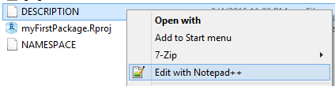

## Step 0: Install Packages to Create Packages

We are going to use two packages to create an R package: `devtools` and `roxygen2`. First, we need to install them.
```{r,eval=FALSE,tidy=FALSE}
install.packages("roxygen2")
install.packages("devtools")

```

These packages make it really easy to create an R package from scratch.

```{r,eval=FALSE}
library(roxygen2)
library(devtools)
```


## Step 1: Create the Package Directory

In the first step, we are going to create a directory for our R package. So before we continue, set the working directory to the location where we are going to save our package.

```{r,eval=FALSE}
setwd("R tutorials/")
```
Now we can create the package directory. We are going to name our package `myFirstPackage`
```{r,eval=FALSE}
create("myFirstPackage")
```

This directory contains the folders where we are going to save the functions and the help files. You should now have a folder named `myFirstPackage`.


## Step 2: Add Functions

We are going to create our first function for our package

```{r,eval=FALSE,tidy=FALSE}
happy_function <- function(happy=TRUE){
  if(happy){
    print("I am happy :)")
  }else{
    cat("I am not happy >:(")
  }
}

```
Save this in as `happy_function.R` in  the `R` folder of the `myFirstPackage` directory.

## Step 3: Add Documentation


The `myFirstPackage` directory contains the `DESCRIPTION` file. You can open and edit the `DESCRIPTION` file using a text editor like Notepad++.

 

The `DESCRIPTION` file contains basic information including the package name, the formal title, the current version number, the date for the version release, and the name of the author and maintainer.

 


The package `roxygen2` makes it really easy to create the documentation. The way it works is that we add some special comments at the beginning of each function that are later compiled into the correct format for the package documentation.  

For our `happy_function`, we are going to add the following

```{r,eval=FALSE}
#' A Happy Function
#'
#' This function allows you to show if you are happy or angry.
#' @param happy Are you happy? Defaults to TRUE.
#' @keywords happy
#' @export
#' @examples
#' happy_function()
happy_function <- function(happy=TRUE){
  if(happy){
    print("I am happy :)")
  }else{
    cat("I am not happy >:(")
  }
}
```

Creating a new file for every function is a way to organize your code. You could also create a single file with all your functions. Just make sure you add the documentation comments before each function.


## Step 4: Process the Documentation

Now you need to create the documentation from the comments that we added earlier. 

```{r,eval=FALSE}
setwd("./myFirstPackage/")
document()
```

This automatically creates `.Rd` files in the `man` directory, and adds a `NAMESPACE` file to the main directory. For our example, we don't really need to do more. For more information, read http://r-pkgs.had.co.nz/description.html 


## Step 5: Install!

All we need to do now is to install our package. We need to install it from the the parent working directory that contains the `myFirstPackage` folder.

```{r,eval=FALSE}
setwd("..")
install("myFirstPackage")
```

We have an functioning R package. For example, we can access the help page for our `happy_function`

```{r,eval=FALSE}
?happy_function
```

 