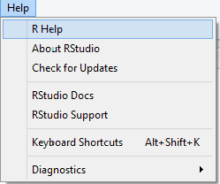

## Finding help pages

R comes with extensive help pages. The help pages can be accessed via the help menu in RStudio  


You can also also access the help pages using the console
```{r, eval=FALSE, tidy=FALSE}
help.start()
```

Typically every function will have its own help page. To access the help page for a particular function you can type the name of the function after `?` or using the `help` command.


```{r, eval=FALSE, tidy=FALSE}
?mean
help(mean)
```

You can search the help pages to get a the help pages that contain a particular key word. For example, we want to search for all pages that contain the word *correlation*. We can do it using `??` or the `help.search` function.  

```{r, eval=FALSE, tidy=FALSE}
??correlation
help.search("correlation")
```


The help page contains a **description**, example **usage**, explanation of all **arguments**, further **details**, explanation of the returned **value**, **references**, **see also** linking to other functions, and **examples**.

To run the examples included in a help page you can use the `example` command.

```{r, eval=FALSE, tidy=FALSE}
example(mean)
```

Simply typing the name of the function, without parentheses, and hitting return will show the source code of the function.

```{r, eval=FALSE, tidy=FALSE}
cor
```


If you have a question about a particular object in R, you might want to look up the help for the "class" of that object, which will tell you how to construct such an object and what methods are available for manipulating such objects. For example, we can find the name of the class of an object and look up help:

```{r, eval=FALSE, tidy=FALSE}
class(6)
?numeric
?"numeric-class"
```

A quick way to find out what functions are available for a given class. For example, if we want to know what function we can use for `lm` object that we get from fitting a linear model:

```{r, eval=FALSE}
methods(class="lm")
```

A quick way to look up functions in a given package is to write out the package name, two ":" symbols and then trying tab-completion to get a list of functions, exported or not.

```{r}
library(ggplot2)
```

```{r, eval=FALSE, tidy=FALSE}
ggplot2::
```


## Vignettes

A vignette is a long-form guide for a  package. Function documentation is great if you know the name of the function you need, but it's useless otherwise. A vignette is like a book chapter or an academic paper: it can describe the problem that the package is designed to solve, and then show the reader how to solve it.

Many existing packages have vignettes. You can see all the installed vignettes with `browseVignettes()`. 

```{r, eval=FALSE, tidy=FALSE}
browseVignettes()
```

To see the vignette for a specific package, use the argument, `browseVignettes("packagename")`. For example, the vignette for `dplyr`

```{r, eval=FALSE, tidy=FALSE}
browseVignettes("dplyr")
```

To see vignettes for a package you haven't installed, look at its CRAN page.  
e.g., http://cran.r-project.org/web/packages/dplyr.


