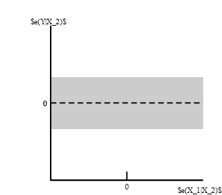
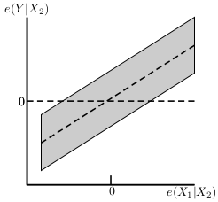
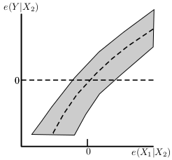

The package `car` has very useful functions to check the assumptions for linear regression. 

```{r, eval=FALSE}
install.packages("car")
```


after installing the package, we are going to load it

```{r}
library(car)
```

## Duncan Data Set

We are going to use the `Duncan` data set from `car` for the following example. This data set has information on the prestige and other characteristics of 45 US occupations in 1950. We are going to use three variables 

* `prestige`: percentage of participants that rated the occupation as excellent or good in prestige  
* `income`: precent of males earning $3,500 or more in 1950  
* `education`: percent of males in occupation who were high-school graduates in 1950  


We are going to regress `prestige` on `education` and `income`.  
```{r}
data(Duncan)
fit <- lm(prestige ~ income + education,data=Duncan)
```

## Outliers

The function `qqPlot` creates a QQ-plot of the residuals with 95\% confidence bands. 
```{r}
qqPlot(fit, main="QQ Plot")
```

Potential outliers will lie close or outside the confidence bands. From the plot, we can see a point in the upper right corner close to the confidence bands.  

More formally, we can use `outlier.test` function. This function performs a t-test on the largest absolute residual in the model to determine if it is an outlier. 

```{r}
outlierTest(fit)
```
The Bonferroni-adjusted p value is not statistically significant, so the observation for `minister` doesn't seem to be an outlier.


## Influential Observations

Cook's distance measure the influence of an observation on the linear model. Intuitively,  Cook's distance measures the effect of deleting a given observation on the fitted values from the linear model.  

Observations with a Cook's distance greater than  
$\dfrac{4}{n-k-1}$  
are considered influential points where $n$ is the number of observations and $k$ is the number of predictors. 

We can get Cook's distance using the `cooks.distance` function. We are going to plot Cook's distance for all observations and plot a line with the cut-off for influential observations.


```{r}
cutoff <- 4/((nrow(Duncan)-length(fit$coefficients)-2))
plot(cooks.distance(fit))
abline(h=cutoff)
```

We can see that we have 2 influential observations. We can label these points interactively in R using the `identify` function. After running the line below, click the points that you want to label and then press `Esc`

```{r,eval=FALSE}
identify(1:45, cooks.distance(mod.duncan), row.names(Duncan))
```

The two influential points correspond to `minister` and `conductor`


## Added Variable Plots

Added variable plots are a way to visualize the marginal role of an individual variable within a regression model given that other variables are already in the model

Main uses  

* Whether a variable has a significant marginal association with $Y$ (given other independent variables already in model) and thus should be included in the model  
* The possibility of a nonlinear relationship between $Y$ and individual $X$ variable in the model 

Suppose we have two variables: $X_1$ and $X_2$. We want to measure the role of $X_1$ given that $X_2$ is already in the model
$Y = \beta_0 + \beta X_2 + \epsilon$

To get the AV plot we  

1. Regress $Y$ on $X_2$ and get the residuals $e_i(Y|X_2) = Y_i - \hat{Y}_i(X_2)$  
2. Regress $X_1$ on $X_2$ ($X_1 = \alpha_0 + \alpha X_2 + \epsilon$) and get the residuals  $e_i(X_1|X_2) = X_{i1} - \hat{X}_{i1}(X_2)$  
3. The scatter plot of $e_i(Y|X_2)$ and $e_i(X_1|X_2)$ provides a graph of the strength of the relationship between $Y$ and $X_1$ adjusted for $X_2$  


|:-------------:|:-------------:|:-------------:|
|  | |  |
| **a** | **b** | **c** |


a. No apparent relationship: $X_1$ does not add to the explanatory power of the model, when $X_2$ is already included  
b. Linear relationship between $Y$ and $X_1$ exists when $X_2$ is already in the model: $X_1$ should be in the model  
c. The partial relationship of $Y$ with $X_1$ is curvilinear: try to model this curvilinear relationship with a transformation of $X_1$  


To get the AV plots we can use the `avPlots` function. 
```{r}
avPlots(fit)
```


From the AV plots, we can see that it seems like a good idea to include both `income` and `education` in our model.


## Non-normality

One of the assumptions of linear regression is that the residuals follow a normal distribution. We can plot a histogram for the residuals and compare it to a normal distribution. 
```{r}
sresid <- rstudent(fit)
hist(sresid, freq=FALSE,
     main="Distribution of Studentized Residuals")
xfit<-seq(min(sresid),max(sresid),length=40)
yfit<-dnorm(xfit)
lines(xfit, yfit) 
```

Also, we can use a QQ-plot. 

```{r}
qqPlot(fit, main="QQ Plot")
```

From the plots above, the residuals seem fairly normal


## Non-constant Error Variance

Another assumption of linear regression is that the error terms have constant variance. A way to visualize the varaince is plotting the residuals vs. the fitted values. The points should be spread evenly across the plot. We can get this plot with the `spreadLevelPlot` function.
```{r}
spreadLevelPlot(fit)
```

We can test this assumption more formally using the `ncvTest` function. The null hypothesis is that the variance is constant. So we if we get a large p-value it means that the assumption of constant variable is likely to hold.
```{r}
ncvTest(fit)
```

Since we get a $p=0.5370169$, it seems that the assumption of constant variance holds for our model.

